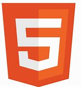
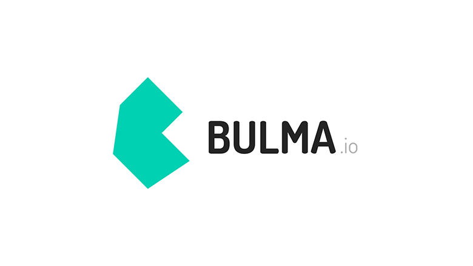
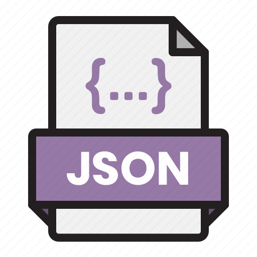
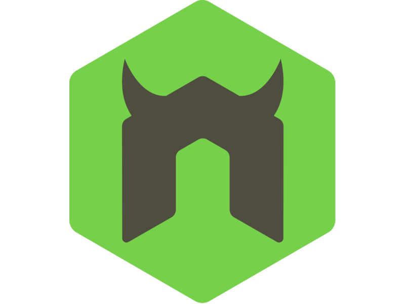
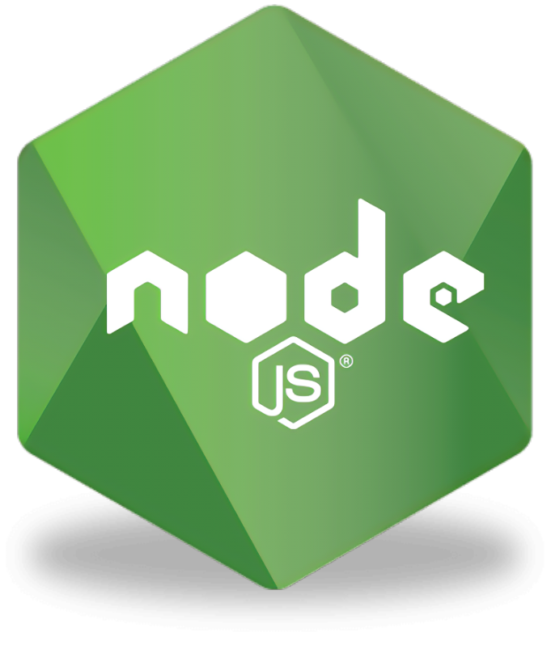
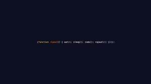

cHi there 👋🏾

<a class="badge-base__link LI-simple-link" href="https://www.linkedin.com/in/nicholas-ewata-b0976b23b">Ewata Nicholas</a>

              
Welcome To Hollas' Profile😀😈

#### Connect with me 

#### About
Here are some basic things to know about Hollas;

- 🔭 I’m currently working on acquiring more skills,
- 🌱 I’m currently learning Fullstack Web Development, with a hands on knowledge of the Frontend aspect of it
- 👯 I’m looking to collaborate on projects,
<!--- 🤔 I’m looking for help with--> 
- 💬 Ask me about anything,
- 📫 How to reach me: Email: nicholasolajide@gmail.com, Phone: (+234) 09054212352, 08089080648,
- 😄 Pronouns: He/Him/His,
- ⚡ Fun fact: I love Animes, gaming, movies, cartoons(basically all works of animation), comics and mangas(manhua/manwhas too), reading(mostly just fictional books).

#### Core Languages
<code></code>
<code></code>
<code></code>
<code></code>

#### Frameworks
<code></code>
<code></code>
<code></code>
<code></code>
<code></code>
<code></code>
<code></code>

#### Tools
<code></code>
<code></code>
<code></code>
<code></code>
<code></code>
<code></code>
<code></code>

<!-- Find ur own picture, na my own pic dey here -->
<code></code>

